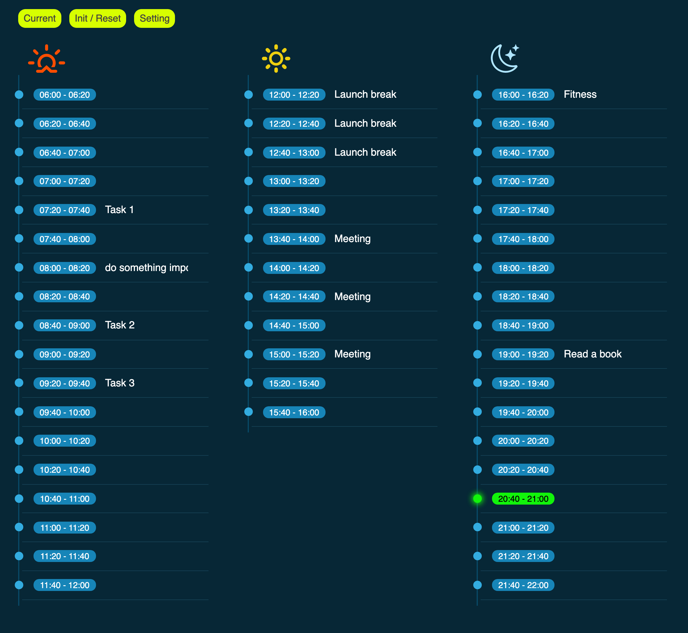

<div align="center">
  
  <h3>An (Elon) Musk Timer</h3>
  <p>split the day to time slots and assign possible task to these time slots.</p>
  
  <p>
    <a href="#">
      
    </a>
    <a href="#">
      
    </a>
  </p>
</div>

---

## Live Demo
<https://musktimer.vercel.app/>

## Install
```bash
npm install 
```


## Development
```bash
npm run dev 
```

## Build
```bash
npm run build 
```

## Resource

<https://github.com/supabase/supabase/tree/master/examples/react-todo-list>


> Get this template using npx or simply download it from GitHub  

`npx degit richajak/vite-preact my-project`


## licence

[MIT](./LICENSE) License © 2021 [@vikbert](https://vikbert.github.io/)
